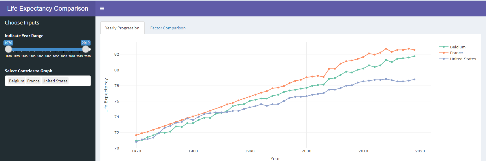
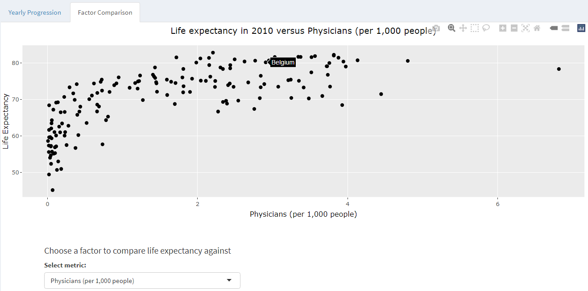

# Life-Expectancy-Visualization
Visualization of life expectancy trends by country since 1970 in an R Shiny app.

## Dependencies
shiny, shinydashboard, tidyverse, plotly, reshape
This project was made with R 4.1.0

---

## How to Run
### The Shiny app:
Make sure App.R and Data.csv are in the same folder. Open App.R in R and press "Run App"

### The Data Exploration and Cleaning File: 
Make sure ExploreAndClean.R and WorldBankHealthData.csv are in the same folder. Open ExploreAndClean.R
in R. This file can be run in parts for intermediate outputs and visualizations (see comments throughout
file), or as a whole. If run as a whole, it will output a Data.csv file which is the input for App.R

---

## Data Exploration and Cleaning
The data was extracted from Google's BigQuery database using an SQL query to get the characteristics 
and date range of interest. It was first reviewed for data completeness, using:
* Scatterplots. A full dataset would have had 6 datapoints per country per year
* A binary image to visualize where data was missing for the Life Expectancy variable

Data was reviewed for accurracy and reasonableness using:
* Boxplots to view the spread of data
* Density plots per metric

In the end, non-country regions (i.e. 'Europe') were removed, along with countries with insufficent
data. Several metrics also had abnormally high peaks at 1.0, which I also removed under the assumption
this indicated the data was not correct at this point. For some metrics this was obviously inaccurate
(i.e. Life Expectancy)

---

## Data Visualization
The Shiny app in App.R has 2 tabs. On the 'Yearly Progression' tab, the user can select the countries 
and range of years they wish to view, and the life expectancy over time is plotted for each country. 

In the 'Factor Comparison' tab, the user can choose to compare life expectancy to one of 6 other 
variables in a scatter plot. The comparisons are all for 2010, as this year had the most complete data.
When hovering with the mouse, the user can see which country each point corresponds to. 

