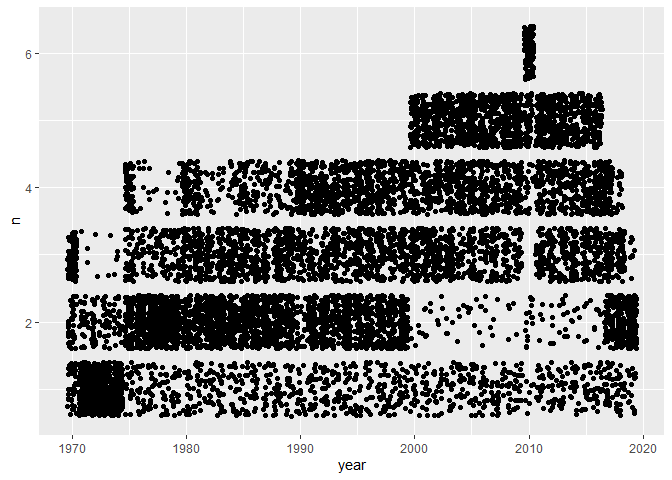
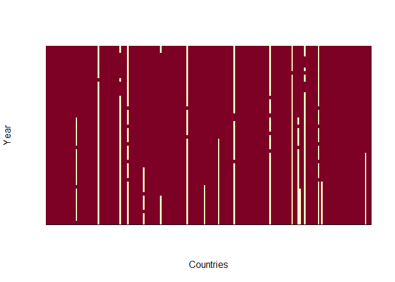
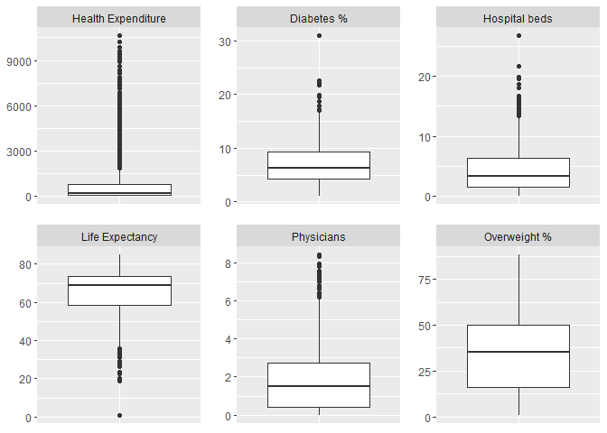
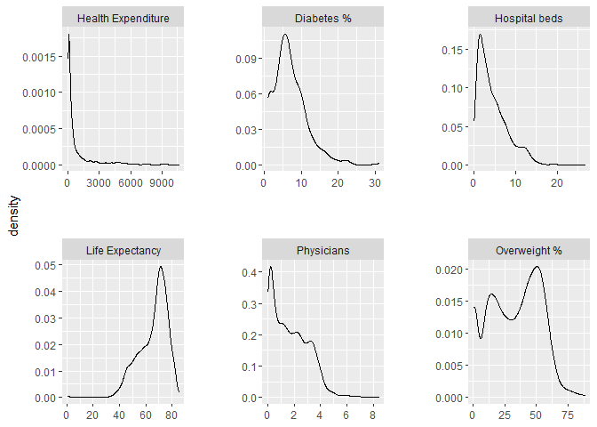
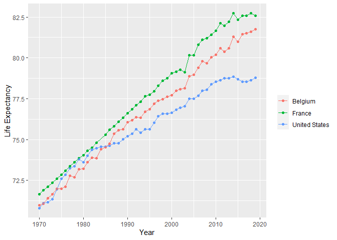
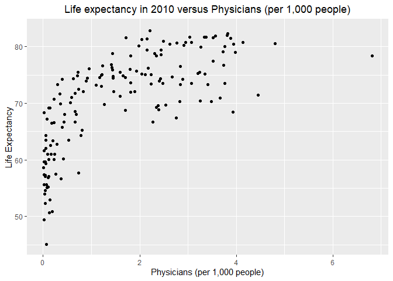

Exploring Data for Life Expectancy App
================

Add libraries

``` r
library(tidyverse)
library(reshape)
library(plotly)
```

Import raw data. This was obtained from Google’s Bigquery database. I
used a SQL query to extract a subset of the data, but asside from that
no further data cleaning has been done

``` r
dfRawData <- read.csv('WorldBankHealthData.csv')
```

Check what countries are included in the dataset

``` r
head(sort(unique(dfRawData$country_name)))
```

    ## [1] "Afghanistan"                 "Africa Eastern and Southern"
    ## [3] "Africa Western and Central"  "Albania"                    
    ## [5] "Algeria"                     "American Samoa"

Upon reviewing, the following entries are not countries, and will be
removed. There are around 40 entries, so only the head is shown

    ## [1] "Africa Eastern and Southern"    "Africa Western and Central"    
    ## [3] "Arab World"                     "Caribbean small states"        
    ## [5] "Central Europe and the Baltics" "Early-demographic dividend"

Remove non-countries

``` r
df <- dfRawData[!(dfRawData$country_name %in% non_contries), ]
```

Check for completeness of dataset. We expect 6 values per country per
year. Scatter plot to visualize how many years have complete data per
country. If the data was complete there would be 6 data points (n) per
year per country, so all points would form a horizontal line (excluding
jitter) at n = 6

``` r
df_count <- count(df,country_name,year)
ggplot(df_count, aes(x = year, y = n))+
  geom_jitter()
```

<!-- -->

The output above makes it clear there is a lot of missing data. Since
2010 appears to have the most complete data, we can restrict the user to
this year when looking at correlations between variables.  
For time series data, excluding countries or years with incomplete data
would greatly reduce the dataset, so absent values will just have to be
dealt with in this case.  
However, life expectancy is the most important variable for our
analysis, so we’ll further evaluate its completeness. We’re concerned
with 2 dimensions (year and country). For this unique case, I can use
the image() function for a rough visualization of the extent of missing
life expectancy data.

``` r
#filter for only life expectancy values
df_LE <- df[df$indicator_name == 'Life expectancy at birth, total (years)', ]

#create wide df of life expectancy values
df_LE_wide <- cast(df_LE, country_name~year)

#convert to a df with 1 if value exists, otherwise 0 if NA. Exclude country_name column
#this will be used to make a binary image
df_binary <- df_LE_wide
df_binary[is.na(df_binary)] <- 0
df_binary[, names(df_binary) != 'country_name'][df_binary[, names(df_binary) != 'country_name'] > 0] <- 1

#convert to matrix, so it can be input into an image.
df_binary <- column_to_rownames(df_binary, 'country_name')
mat_binary <- as.matrix(df_binary)

#Make image to indicate presence of life expectancy data
image(z = mat_binary, yaxt = "n", xaxt = "n", xlab = 'Countries', ylab = 'Year')
```

<!-- -->

We can see that most countries (x axis) have most or all of the life
expectancy data. However, there are a few that have very little. It
wouldn’t make sense to allow the user to graph these, so we’ll filter
out all countries from the data set that have &lt; 50% (25 years worth)
of data To do this, I’ll sum up every row of the binary df, and remove
countries whose sum is less than 25

``` r
#tidy data
df_binary2 <- rownames_to_column(df_binary,'country_name')
df_gathered <- gather(df_binary2,'year','value',2:ncol(df_binary2))

#summarize by sum
df_summed <- aggregate(df_gathered$value, 
                       by = list(country_name = df_gathered$country_name), 
                       FUN = sum)

#filter for countries with < 25 data points
df_lowInfo <- df_summed[df_summed$x < 25, ]

#extract list of countries to remove
countries_to_remove <- c(df_lowInfo$country_name)

#remove these countries from the dataframe
df <- df[!(df$country_name %in% countries_to_remove), ]
```

Now I’ll check the spread of the data by making boxplots for each
variable. This helps to check for any anomalies such as outliers.
Ideally I would do one boxplot per country per variable, but because
there are so many countries, this wouldn’t display well. So, I’ll do one
boxplot per variable.

``` r
p1 <- ggplot(df, aes(y  = value, x = indicator_name))+
  geom_boxplot()+
  facet_wrap(~indicator_name, scales = 'free',
             labeller = labeller(indicator_name = 
                                   c('Life expectancy at birth, total (years)' = 'Life Expectancy',
                                     'Prevalence of overweight (% of adults)' = 'Overweight %',
                                     'Diabetes prevalence (% of population ages 20 to 79)' = 'Diabetes %',
                                     'Physicians (per 1,000 people)' = 'Physicians',
                                     'Hospital beds (per 1,000 people)' = 'Hospital beds',
                                     'Current health expenditure per capita (current US$)' = 'Health Expenditure'
                                   )))+
  theme(axis.text.x=element_blank(),
        axis.ticks.x=element_blank(),
        axis.title.x=element_blank(),
        axis.title.y=element_blank(),
        panel.spacing = unit(1,'lines'))

p1
```

<!-- -->

Density plots are also helpful in visualizing the distribution of data

``` r
p2 <- ggplot(df, aes(x  = value))+
  geom_density()+
  facet_wrap(~indicator_name, scales = 'free', 
             labeller = labeller(indicator_name = 
                        c('Life expectancy at birth, total (years)' = 'Life Expectancy',
                          'Prevalence of overweight (% of adults)' = 'Overweight %',
                          'Diabetes prevalence (% of population ages 20 to 79)' = 'Diabetes %',
                          'Physicians (per 1,000 people)' = 'Physicians',
                          'Hospital beds (per 1,000 people)' = 'Hospital beds',
                         'Current health expenditure per capita (current US$)' = 'Health Expenditure'
              )))+
  theme(axis.title.x=element_blank(),
        panel.spacing = unit(3,'lines'))

p2
```

<!-- -->

From the boxplots we see 11 datapoints with life expectancy = 1
(probably not real). Also saw instances of expenditure per capita = 0
and 0 physicians per 1,000 people. Although it seems unlikely, since
we’re considering data from nearly every country as early as 1970, I’ll
consider this as possible. Also, unlike the data for obesity and
diabetes with a ‘peak’ at 1.0, here there is no obvious peak at 0

``` r
#remove data with life expectancy < 10, since this is probably not real
df <- df[!(df$indicator_name == 'Life expectancy at birth, total (years)' &
           df$value < 10), ]

#remove data with obesity == 1.0, since there is a disproportionately high amount of 
#values here, so this is probably not real
df <- df[!(df$indicator_name == 'Prevalence of overweight (% of adults)' &
                   df$value == 1), ]

#remove data with diabetes == 1.0, since there is a disproportionately high amount of 
#values here, so this is probably not real
df_clean <- df[!(df$indicator_name == 'Diabetes prevalence (% of population ages 20 to 79)' &
                   df$value == 1), ]
```

The df\_clean dataset will be used in the Shiny app to make graphs such
as the ones below. The code in the app will differ in order to allow
interactivity and changing inputs.

``` r
#filter data
df_p3 <- df[df$indicator_name == 'Life expectancy at birth, total (years)' &
              df$year >= 1970 & df$year <= 2019 &
              df$country_name %in% c('United States', 'Belgium', 'France'), ]

#Life Expectancy by year graph

p3 <- ggplot(data = df_p3, aes_string(x = 'year', y = 'value', color = 'country_name') 
              )+
      geom_point()+
      geom_line()+
      xlab('Year')+
      ylab('Life Expectancy')+
      theme(legend.title = element_blank()) 
p3
```

<!-- -->

And:

``` r
df_p4 <- df[df$year == 2010, ]
df_p4_wide <- cast(df_p4, country_name~indicator_name)

#rename columns because ggplot can't handle spaces in names. Below it is done manually
#for demonstration purposes. In the shiny app it is done more robustly so that
#we could use a different dataset with different columns later
names(df_p4_wide) <- c('country_name',
                       'Current',
                       'Diabetes',
                       'Hospital',
                       'Life',
                       'Physicians',
                       'Obesity')

p4 <- ggplot(data = df_p4_wide, 
             aes_string(x = 'Physicians', 
                        y = 'Life',
                        text = 'country_name')) +
      geom_point()+
      xlab( 'Physicians (per 1,000 people)')+
      ylab('Life Expectancy')+
      ggtitle(paste0('Life expectancy in 2010 versus ',  'Physicians (per 1,000 people)'))+
      theme(plot.title = element_text(hjust = 0.5))
    
p4
```

<!-- -->

Export the cleaned data

``` r
write.csv(df_clean,'Data.csv',row.names = FALSE)
```
